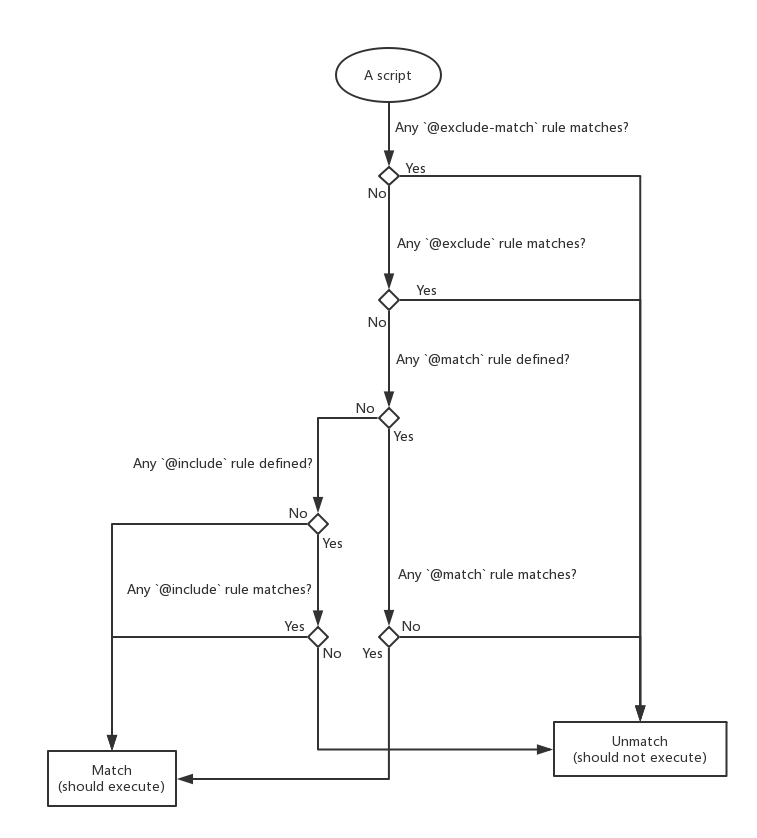

There are four types of rules: `@match` / `@exclude-match` / `@include` / `@exclude` in LibertyBear.

@match / @exclude-match
---

It is recommended to use `@match` / `@exclude-match` rather than `@include` / `@exclude` because the *match* rules are safer and more strict.

`@match` defines a URL matching rule. `@exclude-match` defines a match rule but used to exclude the matched URLs, similar to `@exclude`.

For more details, see [Match Patterns](https://developer.chrome.com/extensions/match_patterns) for Chrome extensions.

Note that match patterns only work on scheme, host and path, i.e. match patterns always ignore query string and hash.

Since LibertyBear v2.10.4, some additional rules are accepted:

- the scheme part accepts `http*` to match `http` or `https`;
- the host part accepts wildcards (`*`) at any position, e.g. `www.google.*`;
- the host part accepts `.tld` to match any top level domain suffix.

Examples:

```js
// @match *://*/*
// @exclude-match *://*.tk/*
```

@include / @exclude
---

Each `@include` and `@exclude` rule can be one of the following:

- a normal string

  If the string does not start or end with a slash (`/`), it will be used as a normal string.

  If there are wildcards (`*`), each of them matches any characters.

  e.g. `https://www.google.com/*` matches the following:
  - `https://www.google.com/`
  - `https://www.google.com/any/subview`

  but not the following:
  - `http://www.google.com/`
  - `https://www.google.com.hk/`

  If there is no wildcard in the string, the rule matches the entire URL.

  e.g. `https://www.google.com/` matches only `https://www.google.com/` but not `https://www.google.com/any/subview`.

  The host part accepts `.tld` to match top level domain suffix.

  e.g. `https://www.google.tld/` matches both `https://www.google.com/` and `https://www.google.co.jp/`.

- a regular expression

  If the string starts and ends with a slash (`/`), it will be compiled as a regular expression.

  e.g. `/\.google\.com[\.\/]/` matches the following:
  - `https://www.google.com/`,
  - `https://www.google.com/any/subview`
  - `http://www.google.com/`
  - `https://www.google.com.hk/`

Examples:

```js
// @include *
// @include https://www.google.com/*
// @include /\.com\.hk\//
// @exclude https://www.google.com/exact/url
```

How does a script match?
---

In short, a script will execute if it matches any `@match` or `@include` rule and does not match any `@exclude-match` or `@exclude` rule.

Here is the long version:

- If any `@exclude-match` or `@exclude` rule matches, the script does not match.
- Otherwise if any `@match` rule is defined, the script matches only if some of the `@match` rules match.
- If no `@match` rule is defined, we fallback to `@include` rules and the script matches only if some of the `@include` rules match.
- If neither `@match` nor `@include` rule is defined, the script is assumed to match.


