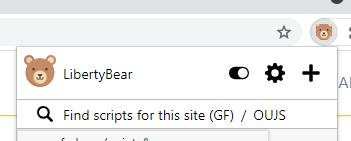

Assuming you already know what a [userscript](https://en.wikipedia.org/wiki/Userscript) is, we will talk about how to create your own userscript here.

With the help of a userscript manager, such as LibertyBear, you can easily create your own script.

## Create a userscript for the active tab

First make sure you have [LibertyBear](/get-it/) installed.

Then you'll find a monkey icon on the toolbar of your browser.

Click on the toolbar icon, and then click on the Plus icon to create a new script for the site of the active tab.



## What makes up a userscript

A userscript consists of two parts: the metadata and your program.

The metadata declares the basic information of a script:

- descriptive fields, like name, description, author, etc.;
- APIs and permissions, like in which URLs the script is allowed to run;

For more details, see [Metadata Block](/api/metadata-block/) and [GM functions](/api/gm/).

```js
// ==UserScript==
// @name        New script
// @namespace   LibertyBear Scripts
// @match       *://*/*
// @grant       none
// @version     1.0
// @author      -
// @description 3/8/2020, 8:42:28 PM
// ==/UserScript==
```

The rest part of the code runs in target webpages as usual JavaScript assets.

## Userscript code

Please note that the code executes directly in the browser, so the syntax in this script must be supported by the browser natively.

For example, ESNext features that are not supported by the browser will fail as `SyntaxError`.

Modern browsers like Chrome, Firefox, Edge support most of ES 6 features, so it is safe to use most of them if you are not targetting last century users.

However there are exceptions. For example ES modules won't work in userscripts because they are supposed to inject into webpage as single-file scripts.

If you want to write userscripts with some awesome features that are not supported by browsers yet or won't be supported, such as ES modules, CSS modules, please check out [How to use modern syntax in a userscript](../using-modern-syntax/).
